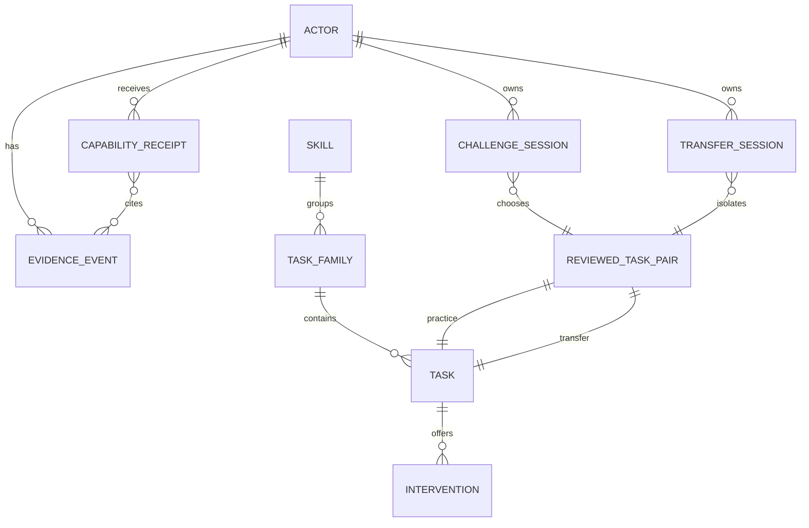

# Domain and content model

> **Status: Active supporting v1.0 content model.** v1.1 extends this model with Subject/Topic/MicroSkill, reviewed rubric facets, lifecycle revisions and published pair banks. Read [v1.1-amendment-contracts.md](v1.1-amendment-contracts.md) before using this document for new work.

## Domain entities

| Entity | Responsibility / identifier | Persisted immutable fields | Mutable fields | Relations / lifecycle | User-facing |
|---|---|---|---|---|---|
| `Actor` | synthetic learner or restricted audit actor; UUID | id, kind, createdAt, seedProvenance | display name only if product later permits | owns sessions/events | learner name only |
| `Skill` | one target capability; stable slug | id, version, title, targetRelation, status | none; publish a new version | has families/pairs | title/summary |
| `TaskFamily` | content grouping for same skill/representation | id, skillId, version, representation, targetStrategy | none | contains tasks | audit only |
| `Task` | a presented item; stable UUID/version | prompt, assets refs, answerSpec, rubric ref, familyId, taskRole, review metadata | none | practice or transfer member of one pair | prompt only |
| `ReviewedTaskPair` | declares valid practice→transfer relationship | id, version, skillId, practiceTaskId, transferTaskId, changeDimensions, relationMapping, review status/notes | publish status only via new version | selected for a challenge episode | reveal summary |
| `Intervention` | immutable reviewed hint | id, version, taskId, exposureTags, body, reviewer/provenance | none | may be opened in practice only | body/title |
| `ChallengeSession` | normal learning episode | id, actorId, practiceTaskId, pairId, startedAt, contentSnapshot | status/closedAt/last activity | has attempts/exposures/submissions; may enable one transfer session | current task/status |
| `TransferSession` | isolated new-situation episode | id, actorId, pairId, transferTaskId, isolationNonce, startedAt, allowedContextSnapshot | status/closedAt | spawned only after verified practice solve | current task/status |
| `EvidenceEvent` | append-only observed/system fact | id, actorId, type, occurredAt, schemaVersion, payload, provenance, correlationId | none | references session/content version | history projection |
| `CapabilityReceipt` | server-derived verified claim | id, actorId, skillId, receiptPolicyVersion, claim, conditions, sourceEventIds, issuedAt, provenance | never edited; a correction is separate evidence | one per eligible transfer result/policy idempotency key | receipt card/detail |

`Attempt`, `Submission`, `InterventionExposure` and `ScoreResult` are **typed event payloads**, not mutable primary entities. This avoids duplicated facts and makes append-only history the source of truth. Read models/materialized views can optimize queries but must be rebuildable.

## ER diagram



## Content contract

All content is authored/reviewed data, loaded through a `ContentRepository`. IDs and versions make fixtures replaceable; the task text itself must never be embedded in challenge business logic.

```ts
type ReviewStatus = 'draft' | 'approved' | 'withdrawn';
type ChangeDimension = 'representation' | 'context' | 'givens' | 'route';
type ExposureTag = 'process' | 'concept' | 'strategy' | 'solution_step' | 'answer';

interface SkillContent {
  id: string; version: string; title: string; targetRelation: string;
  status: ReviewStatus;
}
interface TaskContent {
  id: string; version: string; familyId: string; skillId: string;
  role: 'practice' | 'transfer'; prompt: RichContent; assetRefs: string[];
  answerSpec: AnswerSpec; rubricRef?: string; review: ReviewRecord;
}
interface ReviewedTaskPair {
  id: string; version: string; skillId: string;
  practiceTaskId: string; transferTaskId: string;
  targetRelation: string; changeDimensions: ChangeDimension[];
  relationMapping: ConnectionRevealSpec; review: ReviewRecord;
}
interface InterventionContent {
  id: string; version: string; taskId: string; body: RichContent;
  exposureTags: ExposureTag[]; review: ReviewRecord;
}
```

`ReviewRecord` includes reviewer reference, reviewedAt, notes, validationVersion and source/provenance; it must be `approved` for content to be served in a live demo path. `ConnectionRevealSpec` is pre-authored mappings/explanation, not generated live.

## Answer/rubric contract

```ts
type AnswerSpec =
  | { kind: 'exact_text'; accepted: string[]; normalizationVersion: string }
  | { kind: 'numeric'; expected: string; tolerance?: string; normalizationVersion: string }
  | { kind: 'expression'; expected: string; equivalencePolicy: 'symbolic'; normalizationVersion: string }
  | { kind: 'choice'; acceptedOptionIds: string[]; normalizationVersion: string };
```

Free-text reasoning is optional input. It must not be required as chain-of-thought, and cannot be authoritative unless a teacher-approved constrained rubric adapter is implemented and versioned.
