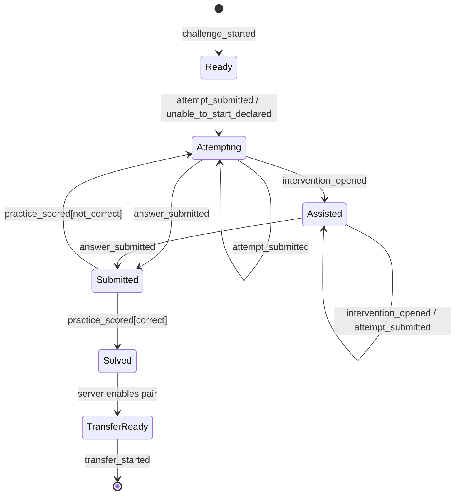
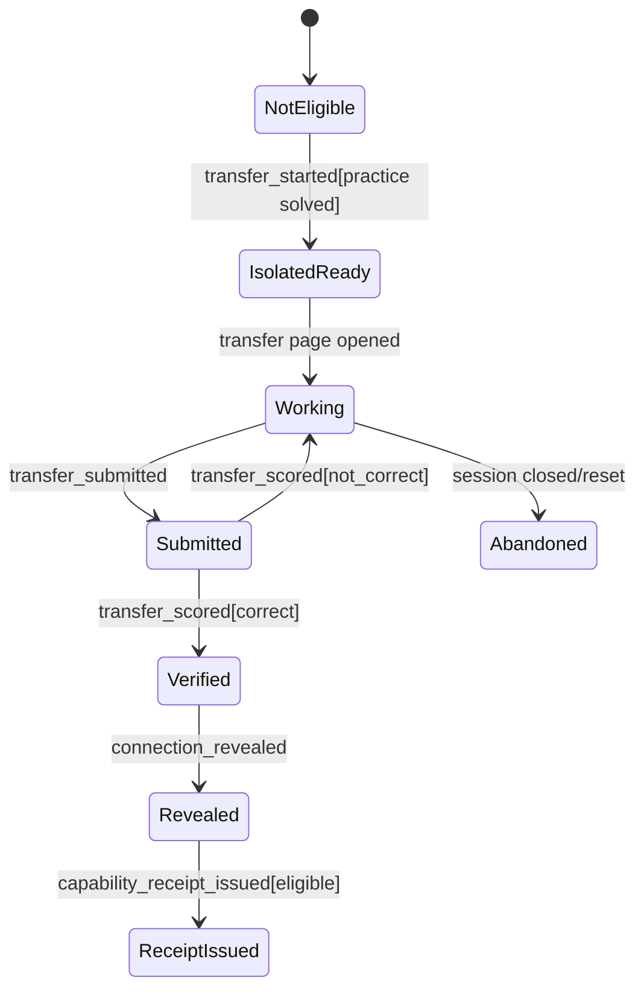

# Append-only evidence and state machines

> **Status: Active supporting v1.0 evidence/state contract.** Preserve append-only and isolation invariants. v1.1 adds assistance, aggregate-grading and content-version facts; current extensions are governed by [v1.1-amendment-contracts.md](v1.1-amendment-contracts.md).

## Event envelope

Every event is committed in the same transaction as the state change it evidences. Historical facts never change; a later correction appends a correction event referencing the earlier event.

```ts
interface EvidenceEvent<T = unknown> {
  id: string;
  type: EvidenceEventType;
  actorId: string;
  correlationId: string;             // one challenge episode / command trace
  challengeSessionId?: string;
  transferSessionId?: string;
  skillId: string;
  taskId?: string; taskVersion?: string; taskFamilyId?: string;
  occurredAt: string;                // server timestamp
  schemaVersion: number;
  scorerVersion?: string;
  policyVersion?: string;
  provenance: 'live' | 'seeded_demo' | 'historical_seed' | 'correction';
  payload: T;
}
```

The server assigns timestamp, provenance and all content IDs. Client-supplied equivalents are ignored.

## MVP taxonomy

| Event | Producer | Minimum payload |
|---|---|---|
| `challenge_started` | start command | practice task/pair content snapshot |
| `attempt_submitted` | attempt command | attempt text or `cannot_start`, ordinal |
| `unable_to_start_declared` | attempt command | same correlation / explicit choice |
| `intervention_opened` | intervention command | intervention id/version, exposure tags, preceding attempt event id, exact content hash |
| `answer_submitted` | submit command | response, optional reasoning presence, ordinal; reasoning retained only per data policy |
| `practice_scored` | scorer | authoritative result, scorer/answer-spec version |
| `transfer_started` | start transfer command | isolated transfer task/pair snapshot, no practice answer payload |
| `transfer_submitted` | submit transfer command | response/ordinal |
| `transfer_scored` | scorer | authoritative result, scorer version, condition flags |
| `connection_revealed` | reveal command | pair/relation mapping version |
| `capability_receipt_issued` | receipt policy | receipt id, cited source event IDs, policy version |
| `delayed_check_completed` | future/seed data | task/result/delay basis; only if actually observed |
| `evidence_corrected` | restricted review action | target event id, reason, replacement reference |

`answer_submitted` is not evidence of correctness; `practice_scored` / `transfer_scored` is. `capability_receipt_issued` is a fact that a policy produced an artifact, not a permanent assertion of mastery.

## Derived state

Read models are projections over events plus immutable content snapshots:

| Projection | Purpose | Must be reproducible from |
|---|---|---|
| `CurrentEpisode` | route a learner to Bài luyện / bridge / transfer / receipt | sessions + latest score events |
| `HomeSummary` | current skill, one next action, compact receipt/history | events, receipts, content |
| `SkillProgressSummary` | familiar/changed-situation/delayed evidence wording | events, not a percentage |
| `HistoryTimeline` | learner-language chronological list | events and content titles |
| `AuditDetail` | versions, exposures, review status, provenance | events/content/receipt sources |
| `ReceiptEligibility` | whether an idempotent receipt can issue | pair + practice score + transfer score + policy |

Later failure does not delete a success. It produces a new event; projections can say `Kết quả ở dạng mới chưa ổn định ở lần gần nhất` with timestamps.

## Practice lifecycle



Guards:

* A task/pair must remain `approved` and content versions must match the session snapshot.
* `intervention_opened` is valid only for that practice task and only before transfer begins.
* A submission must have a non-empty answer under the selected task’s input rules.
* `practice_scored[correct]` uses the authoritative scorer; AI feedback cannot produce it.
* Refresh/resume obtains state by server projection, never client local state alone.

Repeated practice submissions are allowed while the session is open. A correct score freezes the selected practice task for that session; the learner cannot use another practice task to qualify the already-linked transfer task.

## Transfer lifecycle



For MVP, an incorrect transfer answer allows recovery/review but does **not** unlock additional hints or show the answer inside the transfer session. A new transfer attempt must use a server-selected reviewed pair or an explicitly defined retry policy; it cannot reuse the prior transfer answer as a disguised hint.
