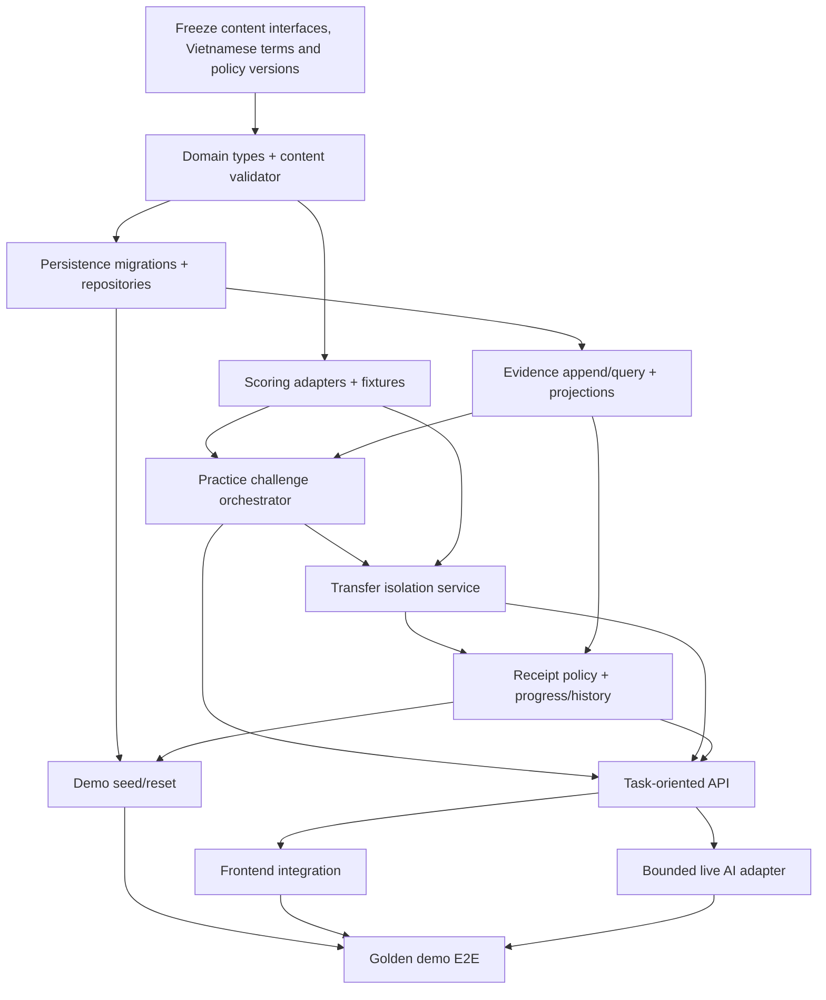

# Dependency graph and freeze gates

> **Status: Historical v1.0 implementation dependency graph; active supporting backend-core reference.** Do not execute it as the current v1.1 plan. Current slice order is [../../superpowers/plans/2026-08-19-competition-demo-v1.1-final-implementation.md](../../superpowers/plans/2026-08-19-competition-demo-v1.1-final-implementation.md).

## Dependency order

## Implementation packages

| Package | Dependencies | Output | Tests required before downstream |
|---|---|---|---|
| A. Freeze interfaces | approved MVP/UI terminology; teacher content still replaceable | IDs, content/event DTOs, policy versions, fixture contract | schema/content validation examples |
| B. Domain/content | A | pure types, content repository interface, reviewed fixture loader | invalid pair/hint/task rejected |
| C. Persistence/evidence | B | migrations, transactional event append, read projections | append-only, rollback, rebuild projection |
| D. Scoring | B | supported deterministic score adapters | normalization/equivalence boundary tests |
| E. Practice flow | C + D | attempt/hint/solve lifecycle | guards, idempotency, resume |
| F. Transfer isolation | D + E | isolated session/DTO/reveal gate | leakage tests, retry/re-entry |
| G. Receipt/progress | C + F | rule-derived receipt and summary/history | qualifying/non-qualifying/correction cases |
| H. API | E + F + G | validated route contract | integration golden server flow |
| I. Demo/reset | C + G + H | clean/history fixtures, safe reset, health | deterministic reset/historical labels |
| J. Frontend | H + I | UI surfaces consume view models | contract/E2E scenario |
| K. Bounded live AI | H | non-authoritative live reasoning feedback for the frozen Demo normal path; deterministic fallback remains for failure resilience | provider/schema/provenance/malformed/timeout tests |

## Safe parallel work

After package A is frozen:

* **Content/scoring stream:** B + D, including fixtures and score test vectors.
* **Persistence/evidence stream:** C, with event schema fixtures.
* **UI shell stream:** static use of approved API view-model fixtures only; it must not define state policy.

After C/D merge, only one owner should change shared domain DTOs, migrations and orchestrator routes at a time. Likely merge-conflict files are the event types, content schema, migration chain, API DTO index and fixture registry. AI adapter work is safely parallel only after its allow-listed input/output contract is fixed.

## Objective gates

### READY TO IMPLEMENT

- [x] AF-01–AF-10 ratified: stack, identity and persistence choices are accepted.
- [ ] One micro-skill may remain placeholder, but fixture schema and `approved` content rule are accepted.
- [ ] Receipt policy, transfer isolation and error codes are accepted.
- [ ] No UI requirement conflicts with server authority in `application-contracts.md`.

### PACKAGE A GATE — PASSED 2026-08-14

- [x] Shared branded domain IDs and policy/version constants compile in strict TypeScript.
- [x] Versioned content, reviewed-pair, intervention and append-only evidence DTOs exist.
- [x] Structural fixture contract is explicitly marked `structural_test_only`; no educational content is claimed validated.
- [x] Content validator accepts the structural contract and rejects unreviewed, invalid-pair and invalid-intervention fixtures.
- [x] Evidence event validator enforces required provenance/version/correction fields.
- [x] `npm run check` and `npm test` pass.
- [x] No persistence, scoring runtime, challenge lifecycle, API, UI or AI adapter was implemented.

### BACKEND CORE READY

- [ ] Approved fixture loads and rejected content fails validation.
- [ ] Full deterministic command path produces append-only evidence and exactly one receipt.
- [ ] Refresh can reconstruct active practice/transfer state.
- [ ] Transfer isolation tests prove forbidden content is absent from DTO/query/AI input.
- [ ] Scorer, receipt and correction tests pass.
- [ ] AI disabled path passes the same authoritative flow.

### READY FOR FRONTEND INTEGRATION

- [ ] API DTOs for Home, practice, transfer, receipt, progress and audit are versioned/stable.
- [ ] Each typed error maps to UI recovery state.
- [ ] Clean and historical demo profiles seed/reset reliably.
- [ ] No client-side policy is needed to produce the approved flow.

### READY FOR DEMO E2E

- [ ] Golden browser flow passes against a deployed-like database with a real bounded AI normal path and an explicitly labelled AI-unavailable fallback path.
- [ ] Presenter reset returns to exact clean state repeatedly.
- [ ] Receipt is visibly derived from current live events; history is visibly seeded/historical.
- [ ] `/healthz`, database failure handling and AI fallback are exercised.
- [ ] Audit shows content/hint/scorer/pair provenance without leaking secrets or private reasoning.
