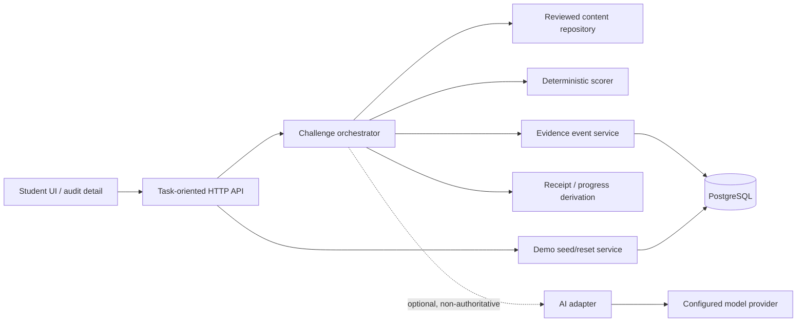

# System overview and module boundaries

> **Status: Active supporting v1.0 system foundation.** Its modular-monolith boundaries remain reusable. Current v1.1 AI/content/grading extensions are defined by [v1.1-amendment-contracts.md](v1.1-amendment-contracts.md), not by older one-pair or post-score-only assumptions.

## Boundary diagram



The browser never talks to an AI provider or database directly. It does not choose a task pair, classify its own hint exposure, calculate receipt eligibility, or author a capability claim.

## Proposed module tree

```text
src/
  domain/          types, IDs, invariant errors; no framework imports
  content/         reviewed content schema, repository, validation
  challenge/       practice-session lifecycle and orchestrator
  interventions/   reviewed hint access and exposure recording
  scoring/         answer normalization and deterministic score adapters
  transfer/        pair selection, isolation-token policy, reveal mapping
  evidence/        append-only event append/query and summary projection
  receipts/        eligibility policy and receipt projection
  ai/              optional provider adapter, schemas, fallback policy
  demo/            fixture seeding and privileged reset
  persistence/     database repositories, migrations, transactions
  api/             route handlers, auth/session middleware, DTO validation
  web/             pages/components; consumes API contracts only
```

Allowed dependency direction:

```text
web/api → application services (challenge, transfer, receipts)
application services → domain + content + scoring + evidence repositories
persistence/ai → domain interfaces
domain ← no framework, HTTP, database, provider or UI dependency
```

`receipts` may read evidence projections but must not mutate event history except by appending a receipt-issued event through the evidence service. `ai` cannot import `receipts`, `transfer` selection logic or a write repository.

## Responsibilities

| Layer | Owns | Explicitly does not own |
|---|---|---|
| Frontend | draft inputs, visual state, animations, safe navigation | authoritative scoring, receipt creation, task eligibility |
| API/application | command validation, orchestration, idempotency, authorization | arbitrary product policy in route components |
| Content | versioned tasks, pair validity metadata, fixed hints, rubric | runtime LLM-generated ground truth |
| Scoring | exact/normalized/symbolic decision | motivational prose or learner labels |
| Evidence | immutable facts and reproducible projections | mastery percentage / personality inference |
| AI adapter | bounded feedback wording / optional reasoning classification | facts, state transition, score override, transfer validity |
| Demo | synthetic accounts, fixture provenance, reset | silent rewriting of a live learner account |

## Chosen identity model

No production OAuth in the Competition MVP. A signed, server-issued **demo profile session** identifies one synthetic learner. The implementation may later add real auth behind the same `Actor` interface, but must not require it for the demo. Audit access is a separate signed demo role or a one-time locally configured presenter mode; it is not exposed in student navigation.
