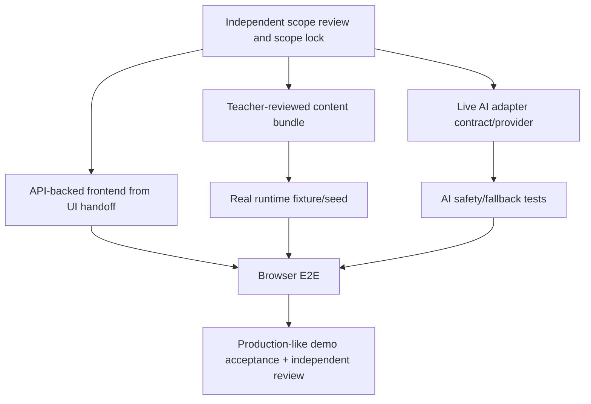

# Competition Demo completion plan — dependency ordered

> **Status: Historical v1.0 completion plan.** Do not execute; current execution authority is the final v1.1 implementation plan.

Parallel after scope lock: teacher content review; server AI adapter (once credential/model is available); and frontend structural binding against frozen API view models. Do not activate a feature that lacks its dependency. The final gate requires all P0 nodes, then an independent full-stack review; it does not start Full Product expansion.
